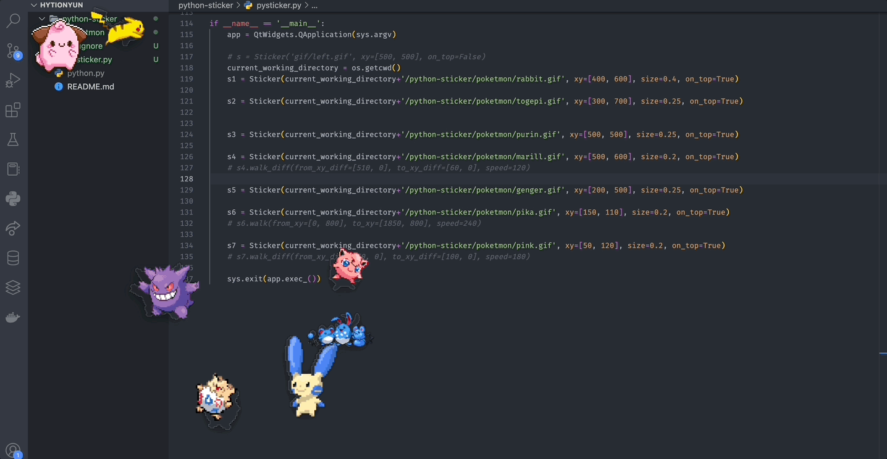

# Character Stickers on Desktop Clone
You can see your favorite gif character on your desktop</br>





## Run

```
pysticker.py
```

## Usage
if you use mac m1, you can run pyqt5 with brew
```
brew install PyQt5
```

```
s1 = Sticker(current_working_directory+'/python-sticker/poketmon/rabbit.gif', xy=[400, 600], size=0.4, on_top=True)
```

- Use `gif/poketmon/rabbit.gif` file
- Put the gif file to `(400, 600)` screen coordinates (x, y) -> initial position
- Resize the image to `40% (0.4)`
- Always on top to `True`

## Reference
```
https://github.com/kairess/animated-wallpaper-sticker
```

## enjoy this!